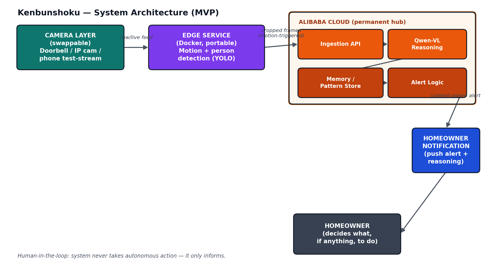

# Kenbunshoku — Project Documentation

Full write-up: problem, solution, architecture, track alignment, ethics, and
future work. See `../CLAUDE.md` for the condensed, code-governing version of
this. The fully-formatted versions (with the rendered architecture diagram,
timelines, and tables) live alongside this file as PDFs:

- `Kenbunshoku_Project_Plan.pdf`
- `Kenbunshoku_Project_Documentation.pdf`
- `Kenbunshoku_Code_Implementation_Plan.pdf`

## Problem
Traditional cameras answer "was there motion?" not "should I care?" — causing
alert fatigue and after-the-fact-only awareness.

## Solution
Camera-agnostic ingestion → edge-level person/motion detection → Qwen-VL
context reasoning on Alibaba Cloud → pattern memory → plain-language,
human-in-the-loop alert.

## Track
Primary: EdgeAgent (Track 5). Supporting theme: pattern memory (MemoryAgent
spirit), not pitched as a second track.

## Ethics
No autonomous action. No weapon/threat detection in MVP. Motion-triggered
crops only, not continuous surveillance video. Framed as context/pattern
awareness, not crime prediction.

## Architecture

The diagram is still accurate at the box level — nothing built required
changing its shape. The boxes map to real code as follows:

| Diagram box | Actual code |
| --- | --- |
| Camera Layer | `camera-simulator/` (phone test rig, never a real dependency) |
| Edge Service | `edge-service/detector.py` (YOLOv8n) → `forwarder.py` |
| Ingestion API | `cloud-backend/ingestion_api.py` `/ingest` |
| Qwen-VL Reasoning | `cloud-backend/qwen_client.py` (`qwen-vl-plus` via dashscope-intl) |
| Memory / Pattern Store | `cloud-backend/memory_store.py` (SQLite) |
| Alert Logic | `cloud-backend/alert_dispatcher.py` |
| Homeowner Notification | `notification-client/` (Flutter, ntfy.sh) |

## Status: as built vs. planned

MVP is functionally complete and has been verified end-to-end on real
hardware, not just locally:

- Real YOLOv8n detections firing against a phone test stream.
- A real classification round trip through Qwen-VL (`qwen-vl-plus`).
- Pattern recognition confirmed: a simulated repeat visitor's 2nd visit
  correctly gets `pattern_context` and has its push alert suppressed
  (familiar/delivery-like only — anomalous never suppresses).
- A real alert delivered to a physical Android phone via ntfy.sh.
- `cloud-backend` deployed and verified live on Alibaba Cloud ECS
  (Singapore), reachable externally, calling Qwen-VL from that instance.

Resolved decisions that were left open in the original plan (see
`docs/TECH_STACK.md` for the full list):
- Notifications: **ntfy.sh**, not Firebase Cloud Messaging.
- Deployment target: **ECS**, not Function Compute.
- Pattern threshold: a visitor is treated as a "recognized pattern" from
  its **2nd** occurrence at a similar time-of-day (not the 3rd, as the
  original `memory_store.py` docstring's example wording implied — 2 was
  chosen so a repeat visitor is caught quickly rather than needing three
  sightings before alert fatigue starts getting addressed).

### Drift from CLAUDE.md found and corrected

- `CLAUDE.md` referenced `docs/TECH_STACK.md` for tech-stack details, but
  the file didn't exist. Created it.
- `CLAUDE.md`'s convention that `docker compose up` brings up edge-service
  and cloud-backend for full local testing was **not actually true**:
  `edge-service/detector.py` had no `if __name__ == "__main__"` entrypoint,
  so the container's `CMD` ran and exited without doing anything. Fixed —
  it now wires `watch_stream()` to `forward_detection()` and reads
  `STREAM_URL`/`CAMERA_ID` from the environment, matching the Dockerfile's
  existing `ENV` defaults.
- The `/ingest` API contract's response shape grew a `pattern_context`
  field once memory/alerts were wired in. `CLAUDE.md`'s API contract
  section was updated at that point, so this one didn't drift — noted
  here only because it's a deviation from the *original* contract.

No hard constraints from CLAUDE.md were violated: no weapon/threat
detection was added, no autonomous action exists anywhere (alert_dispatcher
only ever pushes a notification or suppresses one), all tooling stayed
free/open-source or within voucher credits, edge-service and cloud-backend
remain camera-agnostic, and the backend is genuinely running on Alibaba
Cloud (not just built to run there).

### Known limitations (deliberate MVP scope cuts, not oversights)

- `notification-client` holds a live foreground HTTP connection to ntfy.sh
  rather than using true OS-level background push — alerts only arrive
  while the app is open. Fine for a hackathon demo, not for real use.
- Pattern matching is a simple time-of-day + classification heuristic
  (`memory_store.py`), not learned — matches the "MVP-simple, not ML" note
  already in that file's docstring.
- The deployed ECS instance serves plain HTTP, not HTTPS — acceptable
  since only edge-service (not the phone) talks to it directly, and the
  API key stays server-side, but it's not how this would ship for real.
